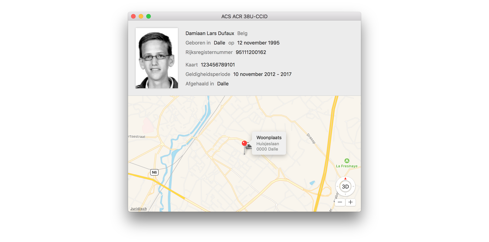

# eidReader

<table>
<thead>
<tr>
<th width=50%>English</th>
<th>Nederlands</th>
</tr>
</thead>
<tr>
<td>A macOS application to read information from Belgian electronic ID cards (also known as beID or belgian eID) without the need to install additional drivers or java software.

Following information is available:
- Profile picture
- First and last name
- Sex
- Place of birth and birthday
- Home address (textual and visual using maps)
- Identification number of the National Register
- Card number
- Validity period

All information can be saved and/or printed.

The application runs in an App Sandbox (without internet connection) and is open source. So you can be sure that it does not leak confidential information to any party.
</td><td>Met deze kaartlezer kan je eenvoudig de informatie van een Belgische identiteitskaart uitlezen. Er is geen driver of java vereist.

Volgende informatie is beschikbaar:
- Profielfoto
- Naam, Achternaam
- Geslacht
- Geboorteplaats, -datum
- Woonplaats (tekstueel en via kaarten)
- Rijksregisternummer
- Kaartnummer
- Geldigheidsperiode van de kaart
- Afhaallocatie

Alle informatie kan opgeslagen en/of afgedrukt worden.

Deze applicatie maakt gebruik van Apples "App Sandbox" technologie, heeft geen netwerktoegang en is volledig open source. Je kan er dus zeker van zijn dat het geen vertrouwelijke informatie doorgeeft (of lekt) aan andere partijen.</td>
</tr>
</table>

## Technology

This application uses Apple's standard `CryptoTokenKit` framework to communicate with the smartcard reader and is written completely in Swift 3.

## Installation

Choose one of the following providers:

| Apple | GitHub |
| ----- | ------ |
|  | Download via [GitHub](https://github.com/Dev1an/eID-Reader/releases/latest) |
